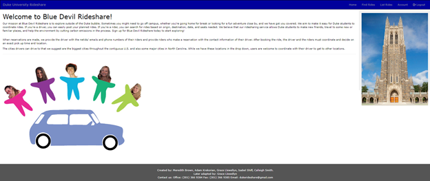

## Welcome to Blue Devil Rideshare, a convenient way for Duke students to carpool and help reduce the costs of gas money! 

These apps are delivered using docker containers. The flask app and the postgres database communicated with the docker network via a docker-compose.yml.

1. In order to launch this web app, you must first download Docker. Download Docker [here.](https://www.docker.com/get-started)

2. Then, git clone from the git directory: [https://github.com/gllewellyn19/Blue-Devil-Rideshare](https://github.com/gllewellyn19/Blue-Devil-Rideshare)

3. Now use your terminal to cd into that directory then the root directory of the project/ flask folder (`cd Blue-Devil-Rideshare/Flask`) and run `docker-compose build` then run `docker-compose up`

4. 
* (For Mac/ Linux): Open a new terminal window and switch into the root directory of the project (`Blue-Devil-Rideshare/Flask`). Run `./setup_db.sh` 
* (For Windows): Open a new Powershell and switch into the root directory of the project (`Blue-Devil-Rideshare/Flask`). 
	1. `docker-compose run web bash`
	2. `psql -h db -U rideshare -d production -a -f create.sql`
	3. `psql -h db -U rideshare -d production -a -f load.sql`

5. Lastly, go to `localhost:8080/rides/` and have fun exploring!

### Additional notes
* There is a demo video called `rideshare_demo.mov` in the top most level
* You must enter a valid duke email address (i.e. ending in @duke.edu) to register, but you may enter a fake email address that ends in @duke.edu. This check is to show that in theory this site should only allow duke users to join and if collaboration with Duke was attained, Duke Shibboleth would be used for registering. 
* For troubleshooting if the page is loading for a long time, try repeating the action (i.e. pressing the button again)